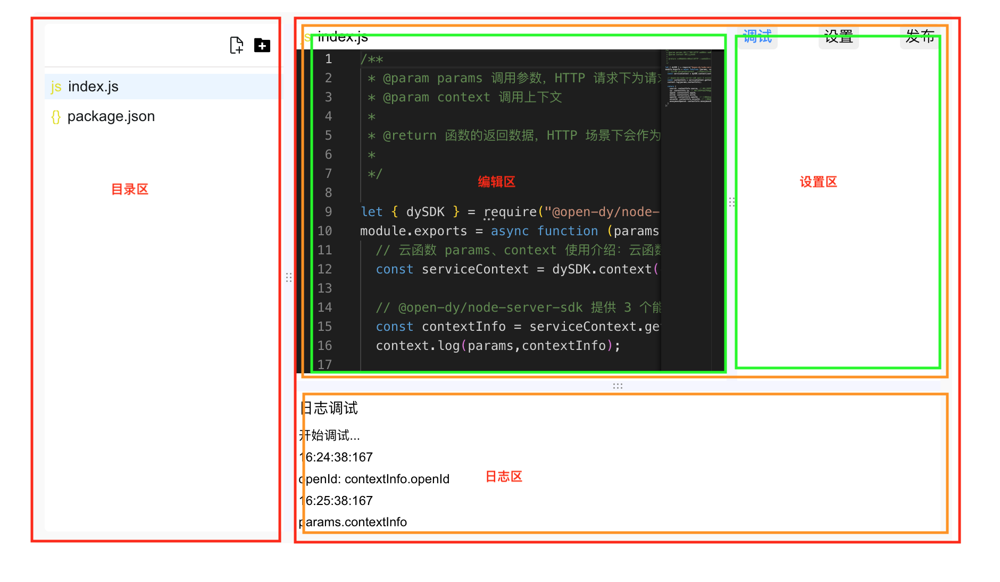

import CloudDemo from './cloudDemo.jsx';

# 使用示例

以下是在「抖音云」项目中使用PanelResize组件的简化版"云函数页面"。

"云函数页面"主要用于函数的编辑、参数设置及代码调试，外层容器使用嵌套的PanelResize组件，可以根据需要拉伸函数目录、代码编辑、日志调试等区域。方便用户编写和查看输出，可自行拖动拖拽条查看功能。

<CloudDemo />

